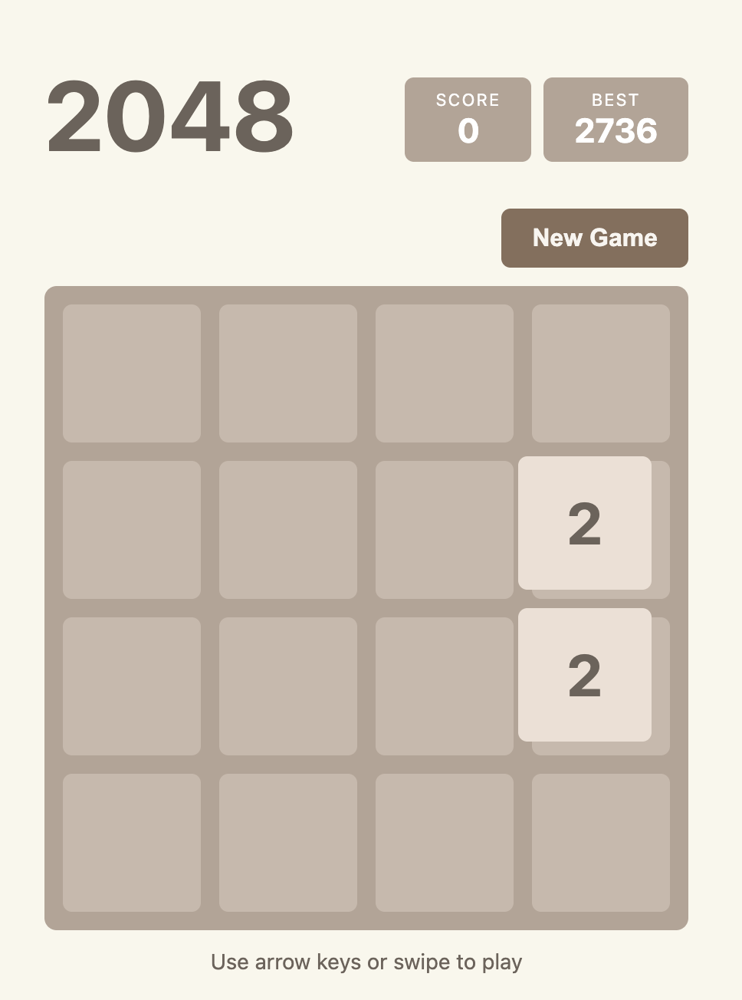

# 2048

A classic 2048 puzzle game in a single HTML file — no dependencies, no build step.

**[Play it now](https://plateaukao.github.io/game2048/)**

## Features

- Keyboard (arrow keys) and touch/swipe controls
- Score and best score tracking (persisted in localStorage)
- Smooth tile animations
- Win and game over detection
- Fully responsive — works on desktop and mobile

## How to Play

1. Use **arrow keys** (or **swipe** on mobile) to slide tiles
2. Tiles with the same number merge into one when they collide
3. Each merge adds to your score
4. Reach **2048** to win!

## Run Locally

Just open `index.html` in any browser — that's it.
